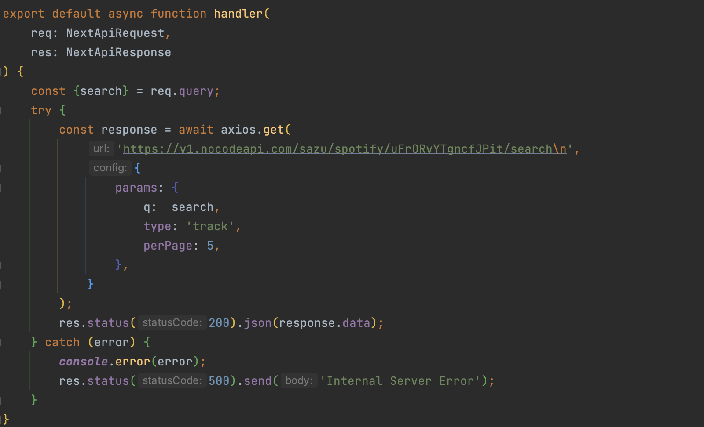
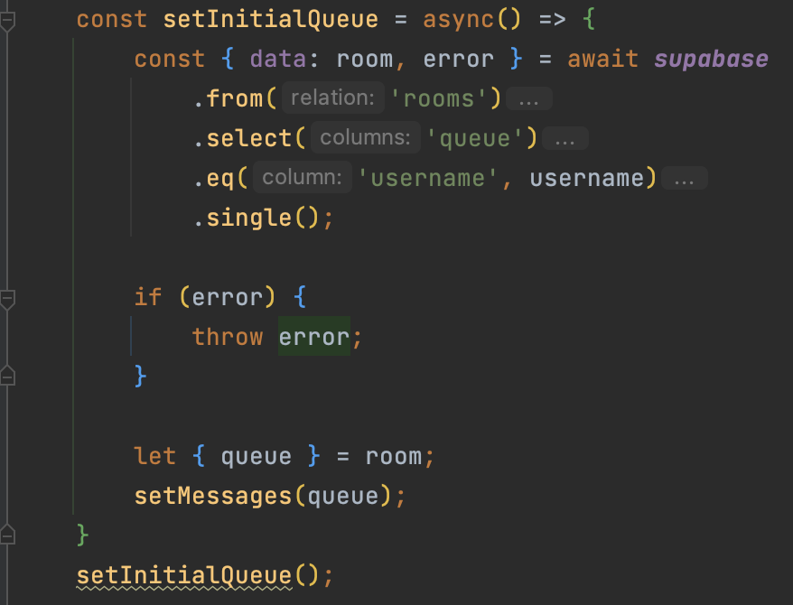

# Under the Hood (The Code)

## getTracks.ts

*param query - Search term that is passed to search.ts in the API calls*

*returns {trackData} - The first few results of searching on Spotify for the queried search term*

*type {(query: string) => (trackData: (name: string, artist: string, albumCover: string))}*

This is the brains of the operation, calling on the Spotify API to get back songs based on the user's input.

They can specify a song, artist, or genre and get back to the top 5 results directly from Spotify.

## search.ts

*param req - Contains {search: string}, the term that is used to query the Spotify API*

*param res - Returns the search results from Spotify in pages containing five results each*

The API call that is used calls on the middleman, NoCodeAPI, who currently uses my Spotify developer credentials to make the search request.

## create-room.ts

*param req - Contains the provided username to use in token creation as the "userID"*

*param res - Returns the created StreamChat token to use and share with users*

The final and most important piece of the puzzle, currently under development, is the api call to StreamChat that creates the room for the host to then share.
Ideal functionality would include a live/dynamic room that exists independent of all other hosts and links. The host would generate their link and share it while being able to join other rooms.

## setInitialQueue 

returns a queue of songs to be displayed on the host page