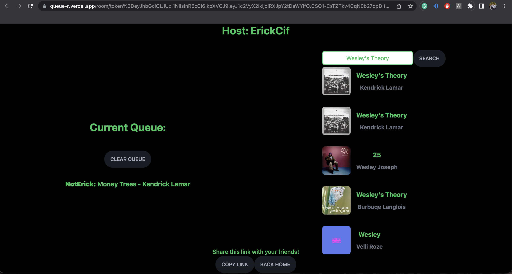

# Welcome QueueR's documentation!

```eval_rst
.. toctree::
   :caption: QueueR
   
   faq
   code

.. note::
    Autodocumentation using sphinx-js in the works!
    
```

### RELEASE 0.0.1: THE BAREBONES
The barebones for QueueR has been released! The goal of this release is to have a roadmap for the application. As of now,
the user gets their "own" room where "other users" can submit song requests, but the rooms themselves are not dynamic and "live," so to speak.
The host cannot send out that link to anyone and have them join to start requesting songs. This is the next step!

[](https://github.com/ErickCif/QueueR/issues)
[](https://github.com/ErickCif/queue-r/actions?query=workflow%3A%22Build+Status%22)
[](https://codecov.io/gh/ErickCif/queue-r)
[](https://queue-r.readthedocs.io/en/latest/?badge=latest)
[](https://opensource.org/licenses/MIT)
</br>

[](https://queue-r.vercel.app)
<center>
(All examples can be found deployed on Vercel to view and mess with) 
</center>

### The Host.

The "home" page has the user first choose their username. The name they choose will be attatched to their room as the host.
In creating their room, StreamChat will generate a token using this username.
### The Queue.

Then, they are greeted with a new page where users can request songs on the right and view the queue on the left.
In the case of the host, they can add songs as they wish and clear the queue when needed/wanted.
